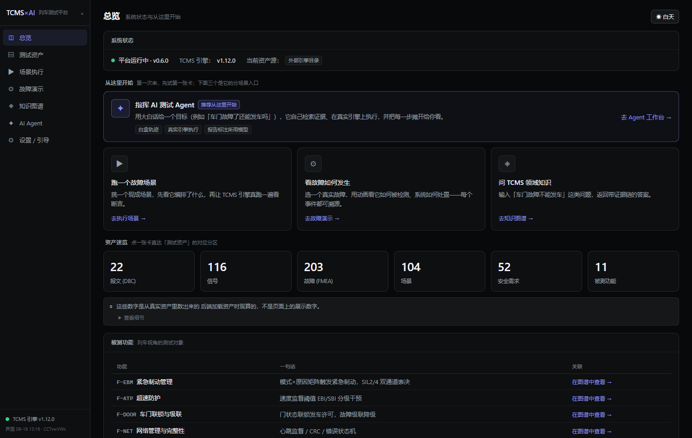

# TCMS × AI —— 列车控制软件测试平台与 AI 测试工程师 Agent

> 面向列车网络控制系统（TCMS / CAN）的**可执行、可自证**测试工程平台 + 一个**真正会干活的
> 领域 Agent**：真实资产 → 领域引擎 → 知识底座 → Agent 查证/造用例/真跑 → 机器自证。
> **全部离线可跑，无需任何 API key。**

[](https://github.com/zych2002918/tcms-agent/actions/workflows/ci.yml)
[](#快速开始)
[](#测试与门禁)
[](#license)



> 上图由 `packages/platform/e2e/capture-doc-shots.mjs` 从**当前构建**采集，
> 并带新鲜度守卫（引擎版本 / 图谱节点 / 资产规模不符即失败）——README 里的数字
> 与界面上的数字因此都不可能靠手抄。

---

## 这是什么

本仓由三个原独立仓库整合而成（**各自完整 git 历史均已保留**），并在其上构建了 Agent 层：

| 原仓库 | 现位置 | 角色 |
|---|---|---|
| `tcms-can-test` | `packages/engine` | **领域引擎**：CAN 仿真、DBC 编解码、场景执行器、安全逻辑与真实资产 |
| `tcms-ai-platform` | `packages/platform` | **平台**：资产模型 + 知识底座（图谱/检索）+ Web UI |
| `tcms-ai-testgen` | `packages/testgen` | **生成器**：受约束 DSL → 编译真实 pytest → 变异杀毒 / 反思自愈 |
| —— | `packages/agent` | **★ 全流程测试工程师 Agent**（本项目主战场） |

```
┌─ packages/agent ──── Agent 认知层：loop / 四级工具面 / 四层记忆 / RAG / 评测
├─ packages/platform ─ 知识底座：知识图谱 + 混合检索 + 资产模型 + FastAPI + Web UI
├─ packages/testgen ── 生成与自证：受约束 DSL → 真实 pytest → 变异杀毒 / 反思自愈
└─ packages/engine ─── 领域引擎：DBC / 故障字典 / 场景执行 / 安全逻辑
```

依赖方向严格单向：`agent → platform → engine`，`testgen → engine`。

---

## Agent 能做什么

```
START → recall → plan → agent ─┬─(有工具调用 且 预算未超)→ act ─┬─(待审批)→ approve → agent
                               │                              └─(无)─────────────→ agent
                               └─(收尾 / 预算耗尽)────────────→ verify → report → END
```

**四级工具权限**（已全部落地，共 15 个工具）：

| 级别 | 工具 | 管控 |
|---|---|---|
| **R0 只读** | kb_search / kb_node / list_scenarios / fault_detail / list_requirements / dsl_reference / list_drafts / kb_filter_assets / symptom_diagnose | 自由调用 |
| **R1 沙箱写** | draft_test_case（受约束 DSL，编译期校验，只写沙箱可丢弃） | 只写沙箱 |
| **R2 真实执行** | run_scenario / verify_fault_action / run_draft | **子进程 + 真超时 + 产物归档** |
| **R3 持久化** | write_memory（引用门禁）/ promote_artifact | **人工审批** |

**三道互相不可替代的闸门**：权限级别（存不存在）→ 人工审批（人放不放行）
→ 机器门禁（内容能不能核实）。高权限工具既不出现在送给模型的 schema 里，
也不可在 `invoke()` 时执行。

**四层记忆**：工作（state）/ 情景（运行日志）/ 语义（知识底座）/ 程序性（离线巩固出的技能）。
巩固走**两道门禁**（引用必须真实 + 证据运行必须存在于日志），`--write` 前默认只出提案。

**RAG**：BM25 + 向量双路 RRF 召回，**图谱作为纯补充路**并入融合；
特征重排；**引用强制校验**覆盖工具链与结论正文。

---

## 一个可能最有意思的部分：框架版 vs 手写版

为回答"自己写的怎么跟成熟框架比"，仓里有一份**手写最小 loop**（`nolib/`，175 有效行），
与本项目的 LangGraph 版**共用同一批节点、同一套工具、同一个模型**，只替换编排层：

```bash
uv run tcms-agent nolib --verify      # 出对照报告 + 8 项能力断言
```

实测结论（可复跑）：

```
任务 11 条：graph 91% / nolib 91%
平均步数 4.82 / 4.82；平均工具调用 3.82 / 3.82
逐条一致（11/11）
```

**框架不参与决策，因此不改变任务结果**；它买到的是能力而非行数：

| 能力 | graph | nolib |
|---|---|---|
| 状态落盘 / 断点续跑 | ✅ | ❌ |
| **人工审批中断** | ✅ 暂停等人 | ❌ 自动拒绝（并如实披露） |
| 轨迹回放 / 流式观测 | ✅ | ❌ |

---

## 快速开始

前置：Python 3.11+ 与 [uv](https://docs.astral.sh/uv/)。

```bash
git clone https://github.com/zych2002918/tcms-agent.git && cd tcms-agent
start.bat          # Windows       —— 自动 uv sync 并起 Web UI
bash start.sh      # macOS / Linux
```

### Agent 常用命令（全部离线可用）

```bash
uv run tcms-agent doctor                          # 环境自检
uv run tcms-agent tools                           # 看工具面与权限级别
uv run tcms-agent run "验证车门故障必须触发降级处置"    # 跑一个目标（离线规则臂）
uv run tcms-agent run "..." --llm                 # 用真模型（需 key，否则如实降级）
uv run tcms-agent run "..." --allow-write         # 开放 R3（终端逐项审批）
uv run tcms-agent history <thread_id>             # 轨迹回放（逐超级步）
uv run tcms-agent memory stats|recall|consolidate # 四层记忆
uv run tcms-agent eval tasks|run|gate             # 评测 / A-B / 回归门禁
uv run tcms-agent nolib --verify                  # 框架 vs 手写对照
```

### 平台界面（Web）：运行期间就是白盒

`start.bat` 打开的工作台上，**运行中就能看到真实步骤**，不是进度动画：

- **自由目标**（一句话 → 解析 → 真实执行）也接了实时流：解析结论、真实查询串、
  完整候选集与选中理由、该场景**实际注入了哪些故障**、断言逐条 expect→actual；
- 每步可展开核对**结构化载荷**，整条轨迹可一键导出 JSON；
- 头部如实标注**谁在决策**（模型名 / 是否本次手动指定 / 是否离线规则臂）；
- **模型可换且可验**：模型选择器支持拉取真实模型清单、筛选、手动输入，
  选择只作用于**本次运行**（不改设置）；「测试连接」真发一次最小请求，
  原样回显错误——因为**配了 key ≠ 能用**（本机实测过一次：环境代理配置坏掉，
  平台每次调用都失败却一直静默走规则臂）。

实测（8 个内置任务，真实运行）：`deepseek-v4-pro-0813` 8074ms → `qwen-turbo` **3090ms**，
达成率与得分**完全一致**（8/8、90 分）——因为结论由引擎断言与引用校验兜住，
模型只负责选场景与给理由。

---

## 打包分发（给新电脑用）

要把整个项目交给一台**没装过任何环境**的电脑，用仓库自带的打包脚本生成一个压缩包：

```bash
uv run python scripts/build_release.py            # 标准包（含包内 uv，约 22 MB）
uv run python scripts/build_release.py --offline  # 额外带依赖缓存，可全程离线
uv run python scripts/build_release.py --no-uv    # 最小包（不含 uv）
```

产物在 `dist/tcms-agent-v<版本>-<日期>.zip`。收件人解压后**双击 `start.bat`** 即可：

| 入口 | 作用 |
|---|---|
| `start.bat` | 启动 Web 界面（自动装 uv → 同步依赖 → 开浏览器） |
| `agent-demo.bat` | 让 Agent 现场跑一遍完整链路（离线，无需密钥） |
| `test.bat` | 自检 + 全量回归 + 静态检查 + 评测基线 |
| `0-先读我-使用说明.txt` | 新电脑上的三步走与常见问题 |

新电脑上**不需要**：Python、Node.js、API key、数据库。前端构建产物已入库，
包内自带 uv，`.python-version` 让 uv 自动准备 Python 3.11。

打包脚本会做三项自检（对**包内实际内容**而非源目录）：单一顶层文件夹、
关键入口齐全、Windows 脚本为 CRLF 且 `.ps1` 带 UTF-8 BOM。

> **两个真实踩过的坑**（都已固化为脚本里的断言）：
> ① `git ls-files` 默认把非 ASCII 路径转义成八进制，用它会**静默漏掉**中文名文件
> （本仓第一次打包就这样漏了 `0-先读我-使用说明.txt`）——必须用 `-z`；
> ② `.bat` 与 `.ps1` 里的中文对编码极其敏感：cmd 按 OEM 代码页解析 `.bat`，
> PowerShell 5.1 无 BOM 时按 ANSI 解析 `.ps1`。因此 `.bat` 保持纯 ASCII 只做壳，
> 中文与逻辑全在 **UTF-8 with BOM** 的 `.ps1` 里，行尾由 `.gitattributes` 强制 CRLF。

---

## 测试与门禁

| 成员 | 命令（成员目录内） | 门禁 |
|---|---|---|
| engine | `pytest tests -q` | 覆盖率 `fail_under=97`（960 collected） |
| platform | `pytest -q` | ruff + pytest + vitest（340 passed + 1 skipped） |
| testgen | `pytest tests --cov=tcms_ai_testgen` | 覆盖率 `fail_under=90`（170 passed） |
| **agent** | `pytest -q` | 含**评测回归门禁**：规则臂 ≥10/11 且零幻觉（192 passed + 2 skipped） |
| 全仓 | `uv run pytest`（仓库根） | 一把梭：**1682 passed + 4 skipped** |

> 4 条 skip 全部是**条件性**的：真语义向量通道 ×2、真实 CAN 硬件 ×1、平台语义通道 ×1。
> 根 `conftest.py` 有一道护栏：monorepo 下找不到上游引擎时**大声中止**，
> 而不是放任几百条测试集体静默跳过（这个坑踩过两次）。
>
> **数字口径**：本表由实测填写（`uv run pytest`）。宁可改数字，也不要让 README 说一个跑不出来的值。

---

## 文档

| 文档 | 内容 |
|---|---|
| `docs/ARCHITECTURE.md` | 架构说明（现状，非愿景）：图拓扑、四级权限、子进程执行、审批拆分、四层记忆、RAG、评测、nolib 对照 |
| `docs/decisions.md` | 26 条 ADR：每条含背景 → 决策 → 理由 → 代价，以及**踩过的坑** |
| `packages/agent/README.md` | Agent 使用说明 |

**这个项目的性格**：文档里写的每个数字都能在代码或测试里指到；
测不出差异的评测会被标注"仪器不对"而不是当成"没有差异"；
被证伪的设计选择会写进 ADR 的"代价"里。

---

## License

MIT —— 根目录 [`LICENSE`](LICENSE) 覆盖整合后的 monorepo 整体。

三个原仓库各自的 LICENSE 仍保留在成员目录下，四者同为 MIT、版权归同一作者：

```
packages/engine/LICENSE      （原 tcms-can-test）
packages/platform/LICENSE    （原 tcms-ai-platform）
packages/testgen/LICENSE     （原 tcms-ai-testgen）
```
